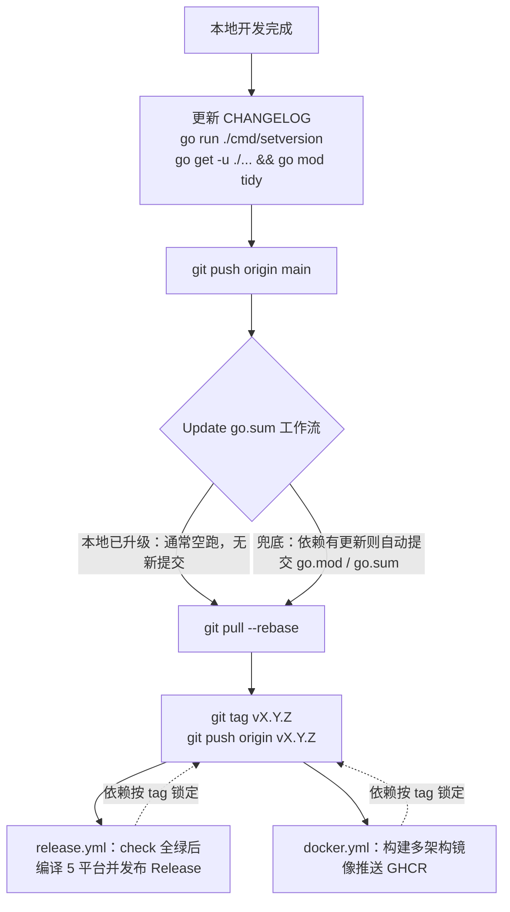

# 部署指南

## 二进制部署

### Linux / macOS

```bash
# 1. 从 GitHub Releases 下载对应平台的 zip 包
# （内含二进制程序 + .env.example + config/ + resources/ 骨架目录 + docs/）
# （Windows 版另含图形控制面板 img-api-gui.exe）
wget https://github.com/chihirosyd/img-api/releases/latest/download/img-api-linux-amd64.zip
unzip img-api-linux-amd64.zip
cd img-api
chmod +x img-api build-index sync-redis health-check

# 2. 准备配置（.env.example 已随 zip 提供）
cp .env.example .env

# 3. 启动服务（前台运行，Ctrl+C 停止）
# 图库目录骨架已随 zip 提供，直接往 resources/txt/pc/ 添加 .txt 即可
./img-api

# 4. 另开一个终端验证
curl http://localhost:8080/health
# 浏览器打开 http://localhost:8080/ 可见教程首页，/random 随机出图
```

后台运行（可选，关闭终端不中断）：

```bash
nohup ./img-api > img-api.log 2>&1 &

tail -f img-api.log        # 查看日志
pkill img-api              # 停止服务
```

> 🍎 macOS 同理：下载 darwin 对应架构的 zip，其余步骤一致；
> 长期运行推荐下方 systemd（Linux）/ launchd（macOS）。

> ⚠️ 启动后编辑 `resources/txt/pc/default.txt` 添加图片 URL（一行一个，即时生效）。
> 如需外部 API，编辑 `config/image.yaml`（重启生效）。
> 本地图片放入新分类目录即时生效；放入已有分类（如 `default/`）需重建索引并重启加载：
> 运行 `./build-index`（源码 `go run ./cmd/build-index/`）后重启服务，
> 或删除 `storage/index/local.json` 后重启自动重建。
>
> 💡 如果图源还没有图片，访问 `/random` 会返回友好的"开始使用"引导页而非报错。

### systemd（开机自启）

```bash
sudo tee /etc/systemd/system/img-api.service << 'EOF'
[Unit]
Description=Random Image API
After=network.target

[Service]
Type=simple
User=www-data
WorkingDirectory=/opt/img-api
ExecStart=/opt/img-api/img-api
Restart=on-failure
RestartSec=5

[Install]
WantedBy=multi-user.target
EOF

sudo systemctl daemon-reload
sudo systemctl enable --now img-api
```

排障与查看：

```bash
systemctl status img-api          # 状态
journalctl -u img-api -f          # 实时日志
systemctl restart img-api         # 修改 .env 后重启
```

### Windows

**方式一：图形控制面板（推荐小白用户）**

```powershell
# 双击 img-api-gui.exe 打开控制面板：
#   - 启动 / 停止 / 重启服务
#   - 编辑核心设置（保存后自动重启生效）
#   - 开机自启（当前用户级，无需管理员）
#   - 后台运行（关闭窗口时最小化到托盘，服务继续运行）
```

**方式二：命令行（服务器/脚本场景）**

```powershell
# 1. 从 GitHub Releases 下载 img-api-windows-amd64.zip
# 2. 解压到目录（如 D:\img-api），exe 必须与 .env、config/、resources/ 同目录
cd D:\img-api

# 3. 复制配置模板（可选，不改则使用默认配置）
copy .env.example .env

# 4. 双击 img-api.exe 运行：控制台窗口显示友好启动横幅，
#    并自动打开默认浏览器到教程首页（含运行状态仪表盘），
#    即可直观确认服务是否正常；关闭控制台窗口即停止服务
#    不想自动打开浏览器：设置环境变量 IMG_API_OPEN_BROWSER=0 后运行
.\img-api.exe

# 5. 浏览器验证（若未自动打开，手动访问）
start http://localhost:8080/
```

> 📁 图库编辑方式与其他平台一致：改 `resources\txt\pc\default.txt` 即时生效，
> 改 `.env` 后重新运行 exe 生效。

#### 后台静默运行（可选，无黑色窗口）

```powershell
# 启动（隐藏窗口，关闭当前终端不影响服务）
Start-Process .\img-api.exe -WindowStyle Hidden

# 停止服务
Get-Process img-api | Stop-Process
```

#### 开机自启（任务计划程序，无窗口）

管理员 PowerShell 执行一次（路径改成你的解压目录）：

```powershell
$action  = New-ScheduledTaskAction -Execute "D:\img-api\img-api.exe" -WorkingDirectory "D:\img-api"
$trigger = New-ScheduledTaskTrigger -AtStartup
Register-ScheduledTask -TaskName "img-api" -Action $action -Trigger $trigger -RunLevel Highest -Force
```

管理：任务计划程序库中找到 `img-api`；移除自启：`Unregister-ScheduledTask -TaskName img-api -Confirm:$false`。

#### 防火墙放行（局域网/公网访问时）

管理员 PowerShell 执行一次（仅本机访问可跳过）：

```powershell
New-NetFirewallRule -DisplayName "img-api 8080" -Direction Inbound -Protocol TCP -LocalPort 8080 -Action Allow
```

> 公网直接暴露更推荐 Docker 部署或前方反代（见下方 Nginx 章节）。

---

## Docker 部署

> 🐳 compose 默认使用 GitHub Actions 自动构建的镜像
> `ghcr.io/chihirosyd/img-api:latest`（推送 tag 后生成），**用户无需本地编译**。

```bash
# 1. 创建项目目录并下载 compose 文件
mkdir img-api && cd img-api
curl -O https://raw.githubusercontent.com/chihirosyd/img-api/main/docker-compose.yml

# 2. 启动（自动拉取镜像；首次运行会在 ./config/ 自动生成 .env）
#    注意：以下所有 docker compose 命令都必须在 docker-compose.yml 所在目录执行
#    （报 no configuration file provided 时先 cd 到项目目录）
docker compose up -d

# 3. 验证
curl http://localhost:8080/health

# 4. 查看/编辑配置（编辑后 restart 生效）
cat config/.env
vim config/.env
docker compose restart
```

> 📁 首次启动会自动创建 `config/`、`resources/`、`storage/` 等挂载目录，
> 并自动生成 `config/.env`、`config/image.yaml`（内置注释示例）以及图库骨架：
> `resources/txt/{pc,pe}/default.txt`、`resources/local/{pc,pe}/default/` 目录，直接编辑即可。
> 图库文件直接放在宿主机对应目录即可（如 `resources/txt/pc/default.txt`），
> 外部 API 池直接编辑自动生成的 `config/image.yaml`（含 picsum / flickr / unsplash 注释模板）。
> 旧版本升级：仅当沿用旧版 compose 的 `./configs` 挂载时，`configs/image.yaml`
> 才会在下次启动时自动复制迁移到 `config/image.yaml`；已按新版 compose 升级的用户
> 需手动 `cp configs/image.yaml config/image.yaml`。
> 镜像更新：`docker compose pull && docker compose up -d`。

> 🛠️ 开发者如需从源码构建：在 `docker-compose.yml` 中注释掉 `image:` 行、
> 取消 `build:` 段注释，然后 `docker compose build && docker compose up -d`
> （本地无 Go 环境也能借此完成编译验证）。

> ⚠️ 启动后需向 `resources/txt/pc/default.txt` 添加图片 URL，一行一个：
> ```bash
> echo "https://example.com/photo1.jpg" >> resources/txt/pc/default.txt
> echo "https://example.com/photo2.jpg" >> resources/txt/pc/default.txt
> ```
> 如需外部 API 池，编辑 `config/image.yaml` 并重启。
> 本地图片索引（`storage/index/local.json`）首启自动生成，
> 可通过 `LOCAL_INDEX_REFRESH_MINUTES` 定时刷新。
> 修改 `.env` 配置后执行 `docker compose restart` 生效。

### 启用 Redis（可选）

取消 `docker-compose.yml` 中 redis 段落的注释，并在 `.env` 中设置：

```ini
REDIS_ADDR=redis:6379  #端口须和 `.env`，`docker-compose.yml`中一致
```

```bash
docker compose up -d

# 同步 TXT 图库到 Redis（在容器内执行；修改 TXT 后需重新运行）
# 注意：img-api 是 compose 服务名（非容器名），可用 docker compose ps --services 查看实际服务名并替换
docker compose exec img-api /app/sync-redis
```

### 手动构建（不使用远程镜像）

```bash
docker build -t img-api .
docker run -d -p 8080:8080 \
  -v $(pwd)/.env:/app/.env \
  -v $(pwd)/config:/app/config \
  -v $(pwd)/resources/txt:/app/resources/txt:ro \
  --name img-api img-api
```

---

## Nginx 反向代理

```nginx
server {
    listen 80;
    server_name img.yourdomain.com;

    # 限流（可选）
    limit_req_zone $binary_remote_addr zone=img:10m rate=60r/m;
    limit_req zone=img burst=10 nodelay;

    # 防盗链（可选）
    valid_referers none blocked yourdomain.com *.yourdomain.com;
    if ($invalid_referer) { return 403; }

    location / {
        proxy_pass http://127.0.0.1:8080;
        proxy_set_header Host $host;
        proxy_set_header X-Real-IP $remote_addr;
        proxy_set_header X-Forwarded-For $proxy_add_x_forwarded_for;
    }
}
```

Nginx 处理时建议关闭 Go 内置的对应功能（`` 标签嵌图不需要跨域，
此处关闭 CORS 不影响博客引用图片）：

```ini
CORS_ENABLED=false
RATE_LIMIT_ENABLED=false
REFERER_WHITELIST=
TRUSTED_PROXIES=172.17.0.0/16（示例，请按照实际填写）   # 可选但推荐：填写后应用自带日志能按真实访客 IP 记录（Nginx 日志不受影响）
```

> 💡 若想保留 Go 内置限流（`RATE_LIMIT_ENABLED=true`），则必须配置
> `TRUSTED_PROXIES=172.17.0.0/16`（Nginx 所在网段）（示例，请按照实际填写），限流才会按
> `X-Forwarded-For` 中的真实客户端 IP 统计；未配置时一律按 Nginx 的 IP 计数。
> 注意：`TRUSTED_PROXIES` 需配合 `proxy_set_header X-Forwarded-For` 才生效，
> 且网段尽量填窄（能覆盖网关即可）。

---

## 更新升级

### Docker（compose）部署

```bash
# 1. （可选）更新 compose 文件（仓库有变动时）
curl -O https://raw.githubusercontent.com/chihirosyd/img-api/main/docker-compose.yml

# 2. 拉取新镜像并重建容器
docker compose pull && docker compose up -d

# 3. 验证版本（看 version 字段）
curl http://localhost:8080/health
```

> 📌 升级不会动你的数据：`.env`、`config/`、`resources/`、`storage/` 均为宿主机挂载，
> 重建容器后配置与图库原样保留。
>
> 📌 固定版本升级：把 compose 里 `image: ghcr.io/chihirosyd/img-api:latest`
> 改为 `:v1.2.0`（替换版本号即可）；`latest` 则始终跟随最新发布。

### 二进制部署（Linux / macOS / Windows）

```bash
# 下载新版本 zip 覆盖旧文件（-o 覆盖；.env / config/ / resources/ / storage/ 保留）
wget https://github.com/chihirosyd/img-api/releases/latest/download/img-api-linux-amd64.zip
unzip -o img-api-linux-amd64.zip
./img-api     # 重启服务
```

Windows：下载新 zip 覆盖解压到原目录（保留 `.env` 与图库），重新双击 `img-api.exe`。

### 回滚

- Docker：把 compose 里镜像版本号改回上一版（如 `:v1.1.0`）→ `docker compose up -d`；
- 二进制：重新下载旧版本 zip 覆盖即可。

### 跨版本注意

- 从 v1.0.x 升级到 v1.1.0+：旧 `configs/image.yaml` 会在首次启动时自动迁移到 `config/image.yaml`；
- 每次升级前建议查看 [CHANGELOG.md](../CHANGELOG.md) 了解变更内容。

---

## GitHub Actions

推送 tag 自动编译 5 平台二进制并发布 Release。依赖以仓库锁定的
`go.mod` / `go.sum` 为准：Release 二进制、Docker 镜像与 CI 检查使用同一套版本
（依赖升级只在本地或 `Update go.sum` 兜底工作流中进行，构建环节不再现场升级）。

### 发布流程



### 发布前本地检查清单（防止 CI 红灯）

```bash
# 单测与静态检查（CI check 同款）
go test ./...
go vet ./...
# 依赖升级并整理（产物与仓库锁定依赖保持一致；之后 gosum 通常空跑）
go get -u ./... && go mod tidy
```

> 💡 Windows 本地 `go vet ./...` 若因 GUI 的 go-gl 依赖报
> `build constraints exclude all Go files`，先 `set CGO_ENABLED=1` 再跑；
> CI 在 Linux 上不受影响（GUI 包仅 Windows 构建）。

### 发布步骤

```bash
# 注：下面命令中的 vX.Y.Z 是版本占位符，请替换为实际版本号（如 v1.5.0）
# 1. 更新 CHANGELOG.md（[未发布] 段改名为 ## [x.y.z] - 日期）
# 2. 同步版本号到代码内置默认值（唯一来源是 CHANGELOG）
go run ./cmd/setversion
# 3. 提交（依赖已在发布前升级）
git add -A && git commit -m "release vX.Y.Z"
# 4. 先推 main：Update go.sum 工作流会兜底检查 go.mod/go.sum（通常空跑无新提交）
git push origin main
# 5. 等 Update go.sum 跑完后拉取，再打 tag 触发发布
git pull --rebase
git tag vX.Y.Z
git push origin vX.Y.Z
```

> 💡 `git pull --rebase` 的作用：把远端 `Update go.sum` 可能产生的自动提交
> 拉到本地，并让本地提交重放到它之上（历史保持直线，不产生 merge 提交），
> 这样 tag 才会打在最新依赖之上。若 gosum 空跑（无新提交），该命令就是空操作。

> ⚠️ 不要跳过第 4、5 步（把 main 和 tag 一起推）：tag 应落在
> `Update go.sum` 兜底提交之后，否则本次 Release 的依赖可能比仓库落后一个版本。

产物（每个平台一个 zip：Linux/macOS 含 4 个二进制，Windows 另含图形控制面板）：
- `img-api-linux-amd64.zip`
- `img-api-linux-arm64.zip`
- `img-api-windows-amd64.zip`
- `img-api-darwin-amd64.zip`
- `img-api-darwin-arm64.zip`

zip 内容：
- `img-api`（Windows 为 `img-api.exe`）：主程序（命令行）
- `img-api-gui.exe`（仅 Windows）：图形控制面板（启动/停止/设置/自启/托盘后台）
- `health-check`：健康检查 CLI
- `build-index`：手动重建本地图片索引
- `sync-redis`：TXT → Redis 同步
- `.env.example`：配置模板（复制为 `.env` 后修改）
- `config/`：外部 API 池配置、`resources/`：图库目录骨架、`docs/`、`README.md`、`CHANGELOG.md`（如仓库已添加 LICENSE 文件也会一并打包）

---

## 性能参考

| 场景 | QPS | 内存 |
|------|:---:|:---:|
| TXT 源（无缓存），100 个 URL | ~20,000 | ~8MB |
| TXT 源（Redis），10,000 个 URL | ~25,000 | ~12MB |
| 外部 API（受远端限制） | ~500 | ~8MB |

> 参考值：Go 1.26，Intel i7-12700H，wrk 4 线程 100 连接（实际性能因环境而异）
